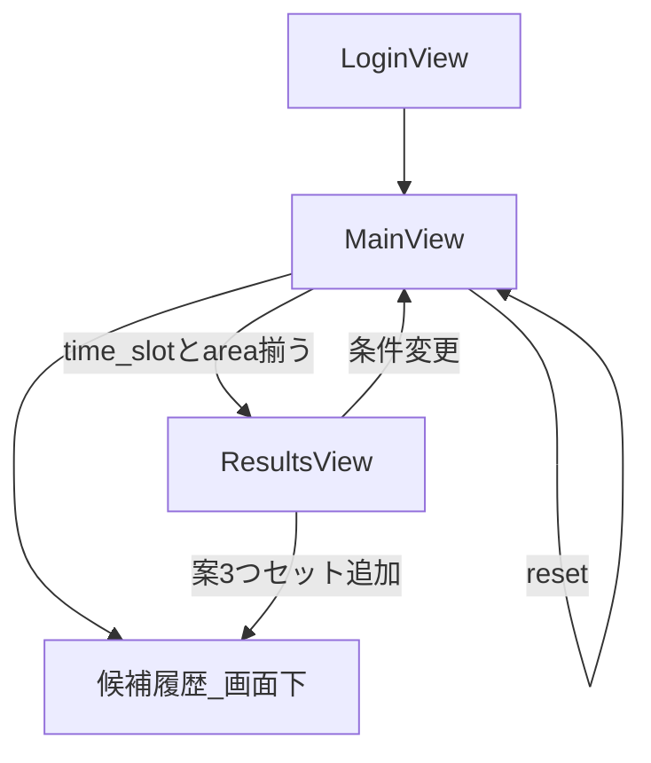

# デートBot Phase B — 仕組み・アーキテクチャ・UI仕様

| 項目 | 内容 |
|------|------|
| 更新日 | 2026-07-19 |
| ステータス | UI完成（ローカル動作確認済み） |
| スタック | FastAPI + HTML/CSS/JS（素のWeb） |
| 推論 | **Gemini一本**（`gemini-3.1-flash-lite` REST） |
| 正本コード | [`app/`](../app/) |
| 前提ノート | [`notebooks/date_bot_gemini_only.ipynb`](../notebooks/date_bot_gemini_only.ipynb) |

Phase A（Colab + LoRA/Gemini）に対し、Phase B は **GPU不要の Web UI** で自分とこゆたんが使えることをゴールとする。

---

## 1. 全体アーキテクチャ

```text
Browser (HTML/CSS/JS)
    │  Cookie session
    ▼
FastAPI (app/main.py)
    ├── auth.py          4桁パスワード + メモリセッション
    ├── slots.py         正規化 / マージ / 不足判定 / 履歴表示用要約
    └── gemini_engine.py Gemini REST（抽出+提案 or 提案のみ）
            │
            ▼
     Google Gemini API（キーはサーバenvのみ）
```

- LoRA / ローカルLLMは **使わない**（後差し込み想定。UIからは隠す）
- 店舗マスタCSVは使わない。Gemini には **slots + 好み要約** のみ
- セッションは **プロセスメモリ**（DBなし）。Spaces は単一プロセス想定



---

## 2. ディレクトリ構成

```text
app/
  main.py              # FastAPI入口・API
  auth.py              # パスワード / セッション
  gemini_engine.py     # gemini_turn / gemini_plans / fallback
  slots.py             # スロット定義・後処理ヘルパ
  templates/index.html # Login / Main / Results の単一HTML
  static/css/styles.css
  static/js/app.js
Dockerfile             # HF Spaces（CPU）用
requirements-web.txt
.env.example           # 秘密はコミットしない（.env は gitignore）
docs/date_bot_ui_phase_b.md  # 本ドキュメント
```

---

## 3. 画面とUX

### 3.1 LoginView
- 4桁パスワード（`APP_PASSWORD`）
- 成功で HttpOnly Cookie `date_bot_session`

### 3.2 MainView（常時1画面）
| 領域 | 内容 |
|------|------|
| 左 | おしゃべり（LINE風アイコン付き吹き出し） |
| 右 | いまの条件（チップ選択 + その他自由入力） |
| 下 | **候補履歴**（案3つセットの積み上げ・見るだけ） |

- 対話と条件パネルは同居。どちらからでも更新できる
- 待ち中は画面中央にハートのローディング

### 3.3 ResultsView
- そのターンの案3つカード
- **条件変更** → MainView（slots・チャット・候補履歴は保持）
- reset で全クリア

### 3.4 候補履歴
- 単位: **そのときの案3つセット**
- 各セットに **条件すべて**（budget / time_slot / area / mood / avoid_areas）と案3つ
- 新しいセットが上。削除UIなし（reset のみ全消し）
- 提案時におしゃべりで「候補セット#N … 履歴にも残す」と通知

---

## 4. 処理フロー

### 4.1 チャット（`POST /api/chat`）

```text
発話
  → 対応外キーワード拒否
  → スロットが残っている & 1文字以下 → 定型聞き返し（Geminiに渡さない）
  → gemini_turn（slotsマージ + 聞き返し or 案3つ JSON）
  → 不足: MainViewのまま
  → 揃った: plan_history追加 → ResultsView
```

### 4.2 条件反映（`POST /api/slots`）

```text
チップ/その他で slots マージ
  → 不足（time_slot / area）: 定型聞き返し
  → 揃った: gemini_plans → plan_history追加 → ResultsView
```

### 4.3 Gemini 入出力
- **chat**: JSON で `slots` / `need_clarify` / `plans`
- **plansのみ**: JSON `{"plans":[{"plan","reason"}, ...]}`（自由文だとパース失敗しやすいため）
- 失敗・タイムアウト・キーなし: エリア別 **フォールバック3案**

必須スロット: `time_slot` と `area`。`budget` 未指定時はデフォルト **3000**。

---

## 5. API一覧

| Method | Path | 役割 |
|--------|------|------|
| GET | `/` | UI |
| POST | `/api/login` | パスワード → Cookie |
| POST | `/api/logout` | Cookie削除 |
| GET | `/api/state` | slots / messages / last_plans / plan_history |
| POST | `/api/chat` | 発話ターン |
| POST | `/api/slots` | 条件反映 |
| POST | `/api/reset` | slots・履歴・候補履歴クリア |
| GET | `/api/health` | ヘルス（キー有無のみ。キー本体は返さない） |

セッション例:

```text
session_id -> {
  slots,
  messages[],
  last_plans,
  plan_history[],   # {id, slots, slots_summary, plans, created_at}
  created_at, last_seen
}
```

---

## 6. 環境変数

| 名前 | 説明 |
|------|------|
| `GEMINI_API_KEY` | Gemini APIキー（必須・Secrets） |
| `APP_PASSWORD` | 4桁パスワード |
| `GEMINI_MODEL_NAME` | 既定 `gemini-3.1-flash-lite` |
| `GEMINI_TIMEOUT_SEC` | 既定 `60` |
| `SESSION_TTL_SEC` | 既定 12時間 |

`.env` は gitignore。雛形は `.env.example`。

---

## 7. ローカル起動

```bash
cp .env.example .env   # GEMINI_API_KEY / APP_PASSWORD を記入
pip install -r requirements-web.txt
uvicorn app.main:app --reload --port 8000
```

ブラウザ: `http://127.0.0.1:8000`

---

## 8. Hugging Face Spaces（次ステップ・無料枠）

1. Docker Space（CPU）
2. Secrets に `GEMINI_API_KEY` / `APP_PASSWORD`
3. リポジトリの `Dockerfile` を使用（port 7860）
4. 有料オプションが必要なら **導入前に必ず確認**

---

## 9. Phase B でやったこと（要約）

- Gemini一本前提の Web アプリ化（Colab GPU制限の回避）
- チャット + 条件パネル同居 UI（デート寄りの見た目）
- 案3つ結果画面 + 候補履歴の蓄積
- 4桁パスワード・キーはサーバ側のみ
- 1文字入力ガード、JSONパース強化、フォールバック

## 10. Phase B 外（意図的にやらない）

- LoRA経路のUI統合
- 本格認証 / DB / 複数レプリカ対応
- 「この案で決定」「不満理由からの再提案」
- スマホ特化の作り込み
- AWS 本格デプロイ
